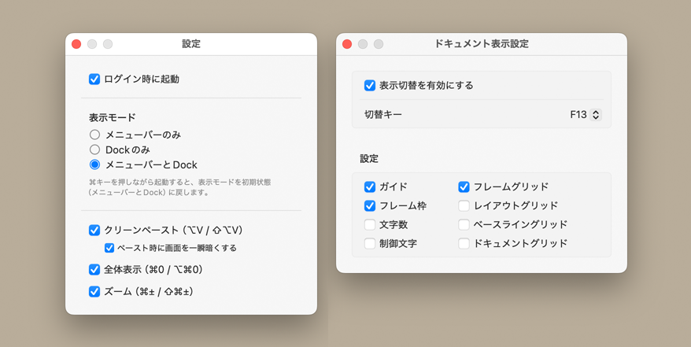

# FILL Id

macOS用デスクトップアプリ

## 用途

FILL Id は、Adobe InDesign の機能にないペーストや表示の操作を、ホットキー（ショートカットキー）で実行するユーティリティアプリです。常駐して動作し、InDesign が最前面のときだけホットキーが有効になります。

## 機能

- **クリーンペースト**：クリップボードの文字を、貼り付け先の先頭の書式を保ったまま選択範囲へ流し込みます。InDesign 標準の「書式なしでペースト」は、ルビが残る、貼り付け先の先頭の書式にならない、互換漢字が統合漢字に変わるといった困った仕様ですが、FILL Id のクリーンペーストはルビが残らず、先頭の書式になり、互換漢字も保護します。
- **全体表示**：ページ／見開き全体を表示します。InDesign 標準の ⌘0 はメインキーボードの 0 でしか効きませんが、FILL Id ではテンキーの 0 でも実行できます。
- **ズーム**：拡大／縮小します。InDesign 標準の ⌘＋ / ⌘− はメインキーボードの ＋ / − でしか効きませんが、FILL Id ではテンキーの ＋ / − でも実行できます。
- **グリッドとガイドの表示切替**：あらかじめ決めたグリッドやガイドの表示／非表示をまとめて切り替えます。

詳細は、FILL Id のヘルプメニュー「FILL Id ヘルプ」を選択してください。

## 動作環境

macOS 13.5 Ventura 以降（Universal Binary）

## ライセンス

This project is licensed under the MIT License - see the [LICENSE](LICENSE) file for details.
